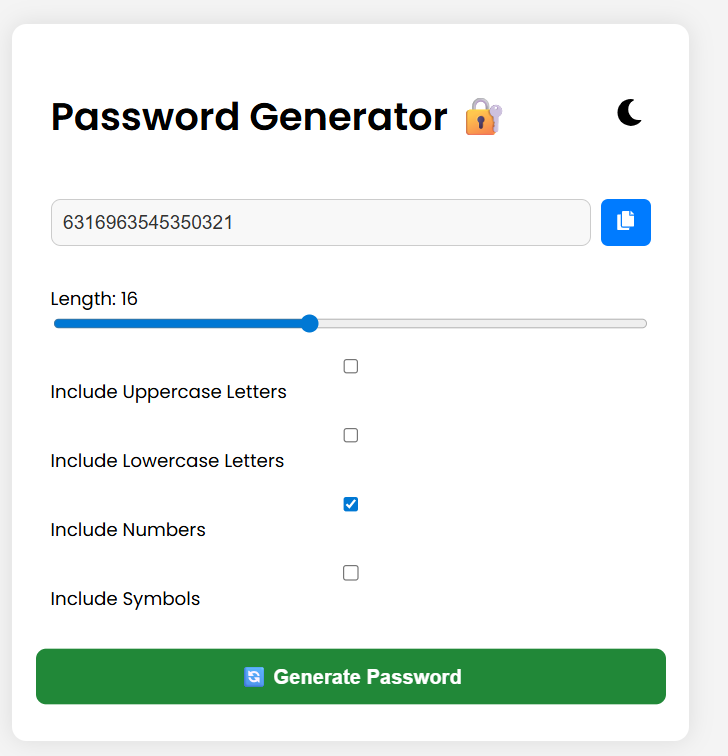
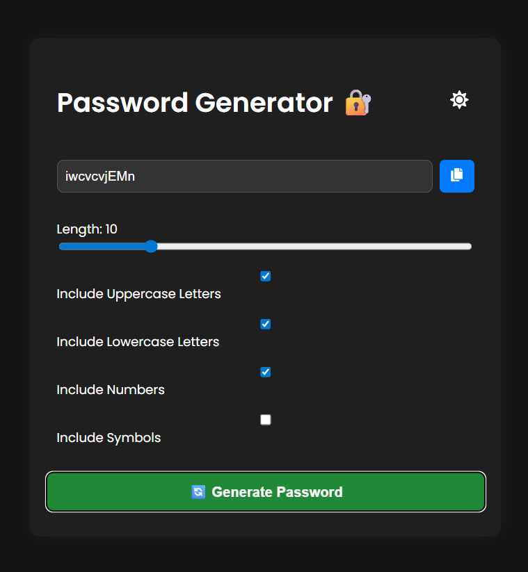

<<<<<<< HEAD
# 🔐 Vaultify - React Password Generator


> A modern, animated password generator built with React, featuring theme toggle, clipboard copy, and full customization. Stylish. Secure. Smooth.

---

## 🚀 Live Demo

👉 [https://vaultify.vercel.app](https://vaultify.vercel.app) ← *(update this after deploying)*

---

## ✨ Features

- 🎚 Adjustable password length (4–32)
- 🔠 Include/exclude uppercase, lowercase, numbers, symbols
- 🌗 Dark & Light theme toggle
- ✂️ Copy to clipboard with animation
- 🧠 Smart default settings
- 📱 Fully responsive UI with transitions

---

## 📸 Preview

| Light Mode                            | Dark Mode                            |
|---------------------------------------|--------------------------------------|
|      |       |

> You can add preview screenshots in a `/screenshots` folder

---

## 🛠 Tech Stack

- ⚛️ React (with Hooks)
- 💨 Custom CSS (animated)
- 📦 Vite for fast dev environment
- 🎨 React Icons

---

## 📦 Getting Started

```bash
# Clone the repo
git clone https://github.com/your-username/vaultify.git

# Go to the project folder
cd vaultify

# Install dependencies
npm install

# Run the app
npm run dev

```

🙌 Contributing
Pull requests are welcome!
If you have ideas for features or improvements, feel free to fork and submit a PR.

🧑‍💻 Author
Ankit Raj

🔗 GitHub (https://github.com/iankitraj/)

📬 DM or raise an issue for feedback or suggestions
=======
# React + Vite

This template provides a minimal setup to get React working in Vite with HMR and some ESLint rules.

Currently, two official plugins are available:

- [@vitejs/plugin-react](https://github.com/vitejs/vite-plugin-react/blob/main/packages/plugin-react) uses [Babel](https://babeljs.io/) for Fast Refresh
- [@vitejs/plugin-react-swc](https://github.com/vitejs/vite-plugin-react/blob/main/packages/plugin-react-swc) uses [SWC](https://swc.rs/) for Fast Refresh

## Expanding the ESLint configuration

If you are developing a production application, we recommend using TypeScript with type-aware lint rules enabled. Check out the [TS template](https://github.com/vitejs/vite/tree/main/packages/create-vite/template-react-ts) for information on how to integrate TypeScript and [`typescript-eslint`](https://typescript-eslint.io) in your project.
>>>>>>> 0711eb8 (Initial commit: Vaultify password generator)
